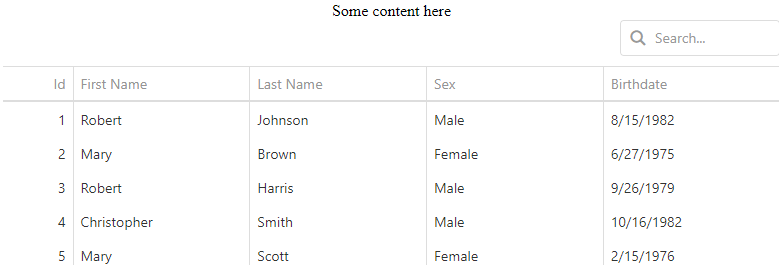

<!-- default badges list -->

<!-- default badges end -->

# DataGrid for DevExtreme - How to fix column headers related to page scrolling

This example demonstrates how to fix DataGrid column headers related to page scrolling.

<!-- run online -->
**[[Run Online]](https://codecentral.devexpress.com/128583180/)**
<!-- run online end -->

## Files to Review

- **jQuery**
    - [index.html](jQuery/index.html)
    - [script.js](jQuery/script.js)

## Documentation

- [Getting Started with DataGrid](https://js.devexpress.com/Documentation/Guide/UI_Components/DataGrid/Getting_Started_with_DataGrid/)

- [DataGrid - API Reference](https://js.devexpress.com/Documentation/ApiReference/UI_Components/dxDataGrid/)
